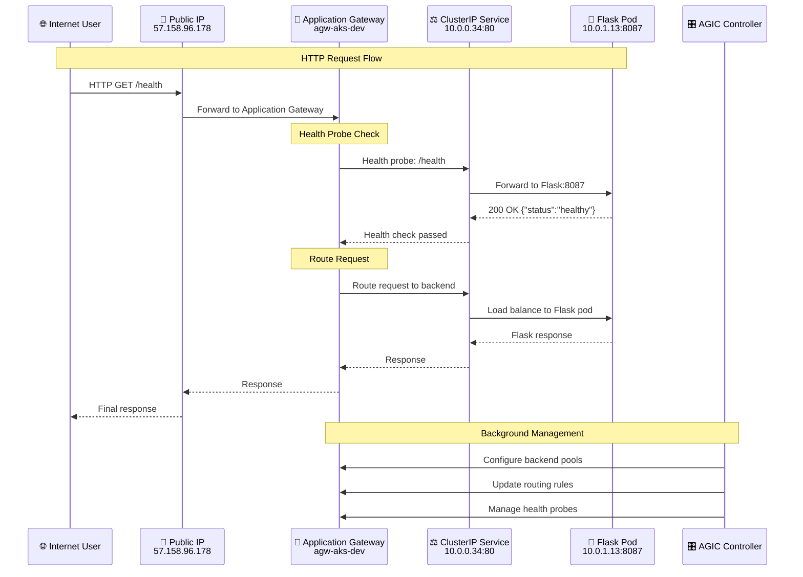
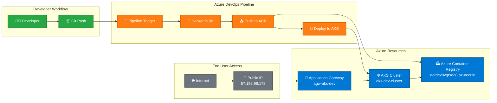
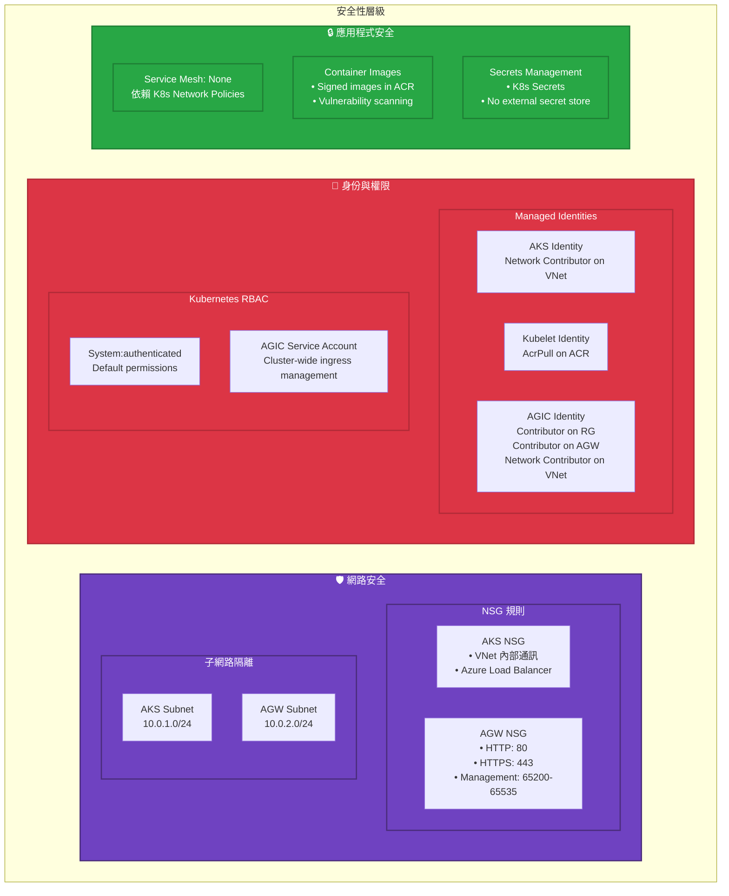

# AKS + AGIC 架構圖

## 系統架構概覽

```mermaid
graph TB
    %% External Layer
    Internet[🌐 Internet] 
    Developer[👨‍💻 Developer]
    
    %% Azure Subscription
    subgraph AzureSub[Azure Subscription: 7f004e94-ef6d-49df-8f43-ac31ddf854fd]
        
        %% Resource Group
        subgraph RG[Resource Group: rg-aks-dev]
            
            %% Virtual Network
            subgraph VNet[Virtual Network: vnet-aks-dev<br/>📍 10.0.0.0/8]
                
                %% AKS Subnet
                subgraph AKSSubnet[AKS Subnet: subnet-aks-dev<br/>📍 10.0.1.0/24]
                    subgraph AKSCluster[AKS Cluster: aks-dev-cluster<br/>🏷️ K8s v1.33.2]
                        
                        %% System Node Pool
                        subgraph SystemNodes[System Node Pool]
                            SysNode1[System Node<br/>Standard_D2s_v3<br/>Zone 1-2]
                        end
                        
                        %% User Node Pool  
                        subgraph UserNodes[User Node Pool]
                            UserNode1[User Node<br/>Standard_D2s_v3<br/>Zone 1-2]
                            UserNode2[User Node<br/>Standard_D2s_v3<br/>Zone 1-2]
                        end
                        
                        %% Kubernetes Resources
                        subgraph K8sResources[Kubernetes Resources]
                            
                            %% Flask Application
                            subgraph FlaskNS[Namespace: py-flask-app]
                                FlaskPod[Flask Pod<br/>📍 10.0.1.13:8087<br/>Image: acrdev9vgrsdq8.azurecr.io/py-flask:latest]
                                FlaskSvc[ClusterIP Service<br/>📍 10.0.0.34:80 → 8087]
                                FlaskIngress[AGIC Ingress<br/>py-flask-agic-ip-ingress]
                            end
                            
                            %% System Namespaces
                            subgraph SystemNS[System Namespaces]
                                AGICController[AGIC Controller<br/>namespace: kube-system<br/>Pod: ingress-appgw-deployment]
                                AzurePolicy[Azure Policy Addon<br/>namespace: kube-system]
                            end
                        end
                    end
                end
                
                %% Application Gateway Subnet
                subgraph AGWSubnet[Application Gateway Subnet: subnet-agw-dev<br/>📍 10.0.2.0/24]
                    AGW[Application Gateway: agw-aks-dev<br/>🏷️ Standard_v2<br/>Zones: 1,2,3<br/>Min: 1, Max: 3 instances]
                end
                
                %% Service CIDR (Virtual)
                ServiceCIDR[Service CIDR: 10.0.0.0/24<br/>DNS: 10.0.0.10]
            end
            
            %% Public IP
            PublicIP[Public IP: agw-aks-dev-pip<br/>📍 57.158.96.178<br/>Static, Standard SKU<br/>Zones: 1,2,3]
            
            %% Container Registry
            ACR[Azure Container Registry<br/>acrdev9vgrsdq8.azurecr.io<br/>🏷️ Basic SKU<br/>Admin Enabled]
            
            %% Network Security Groups
            subgraph NSGs[Network Security Groups]
                AKSNSG[AKS NSG: subnet-aks-dev-nsg<br/>🔒 Default AKS rules]
                AGWNSG[AGW NSG: subnet-agw-dev-nsg<br/>🔒 HTTP/HTTPS + Management]
            end
            
            %% Managed Identities
            subgraph ManagedIdentities[Managed Identities]
                AKSIdentity[AKS Cluster Identity<br/>🆔 2435433a-cec1-4a4e-b453-47f7dfad3c02]
                KubeletIdentity[Kubelet Identity<br/>🆔 Auto-generated]
                AGICIdentity[AGIC Identity<br/>🆔 20b636d1-3ab9-4af1-8515-80aabb26053b<br/>ingressapplicationgateway-aks-dev-cluster]
            end
        end
        
        %% Azure DevOps (External to RG)
        subgraph AzureDevOps[Azure DevOps: kai-lab]
            Pipeline[Flask-AKS-Pipeline-Correct<br/>🚀 Build & Deploy]
            SelfHostedAgent[Self-hosted Agent<br/>🏠 Local Machine]
        end
    end
    
    %% Connections
    Internet --> PublicIP
    PublicIP --> AGW
    AGW --> FlaskSvc
    FlaskSvc --> FlaskPod
    
    %% AGIC Management
    AGICController -.-> AGW
    AGICController -.-> FlaskIngress
    
    %% Developer Workflow
    Developer --> AzureDevOps
    Pipeline --> ACR
    Pipeline --> AKSCluster
    ACR --> FlaskPod
    
    %% Identity & RBAC
    AGICIdentity -.-> AGW
    AGICIdentity -.-> VNet
    AKSIdentity -.-> VNet
    KubeletIdentity -.-> ACR
    
    %% Network Security
    AKSNSG -.-> AKSSubnet
    AGWNSG -.-> AGWSubnet
    
    %% Styling
    classDef azure fill:#0078d4,stroke:#004578,stroke-width:2px,color:#ffffff
    classDef k8s fill:#326ce5,stroke:#1a4b8c,stroke-width:2px,color:#ffffff
    classDef app fill:#28a745,stroke:#1e7e34,stroke-width:2px,color:#ffffff
    classDef network fill:#6f42c1,stroke:#4a2c7a,stroke-width:2px,color:#ffffff
    classDef security fill:#dc3545,stroke:#b02a37,stroke-width:2px,color:#ffffff
    classDef devops fill:#fd7e14,stroke:#e55a00,stroke-width:2px,color:#ffffff
    
    class PublicIP,ACR,AGW,AKSCluster azure
    class FlaskPod,FlaskSvc,FlaskIngress,AGICController k8s
    class Internet,Developer,Pipeline app
    class VNet,AKSSubnet,AGWSubnet,ServiceCIDR network
    class NSGs,ManagedIdentities,AKSNSG,AGWNSG security
    class AzureDevOps,SelfHostedAgent devops
```

## 網路流量路徑

## 部署流程圖

## 安全性架構

## 資源清單摘要

| 類型 | 資源名稱 | 規格 | 備註 |
|------|---------|------|------|
| **🏗️ 基礎設施** | | | |
| Resource Group | rg-aks-dev | East Asia | 統一管理 |
| Virtual Network | vnet-aks-dev | 10.0.0.0/8 | Azure CNI |
| AKS Subnet | subnet-aks-dev | 10.0.1.0/24 | Kubernetes nodes |
| AGW Subnet | subnet-agw-dev | 10.0.2.0/24 | Application Gateway |
| Public IP | agw-aks-dev-pip | 57.158.96.178 | Static, Standard |
| **☸️ Kubernetes** | | | |
| AKS Cluster | aks-dev-cluster | v1.33.2 | Azure CNI + Calico |
| System Node Pool | system | Standard_D2s_v3 | 1-3 nodes, Zones 1-2 |
| User Node Pool | user | Standard_D2s_v3 | 1-5 nodes, Zones 1-2 |
| **🚪 Application Gateway** | | | |
| Application Gateway | agw-aks-dev | Standard_v2 | Autoscale 1-3, Zones 1-3 |
| **🏭 Container Registry** | | | |
| ACR | acrdev9vgrsdq8 | Basic SKU | Admin enabled |
| **🛡️ 安全性** | | | |
| AKS NSG | subnet-aks-dev-nsg | Default rules | VNet + LB access |
| AGW NSG | subnet-agw-dev-nsg | HTTP/HTTPS/Mgmt | Internet access |
| **🆔 身份識別** | | | |
| AKS Identity | SystemAssigned | Network Contributor | VNet management |
| AGIC Identity | UserAssigned | Multiple roles | AGW + VNet access |
| Kubelet Identity | UserAssigned | AcrPull | Container pulls |

## 成本估算 (每月)

| 資源 | 規格 | 預估成本 (USD) |
|------|------|---------------|
| AKS Cluster | 2-8 nodes × Standard_D2s_v3 | $150-600 |
| Application Gateway | Standard_v2, 1-3 instances | $50-150 |
| ACR | Basic SKU | $5 |
| Public IP | Static Standard | $4 |
| VNet | Standard | Free |
| **總計** | | **$209-759** |

*註：成本會依據實際使用量、region 和 Azure 優惠而變動*